

  

# Raising Reimagined

**No-cost fundraising platform connecting local suppliers, organizations & communities**

**~5,000 users · 198 campaigns · $127K raised in 2024**

---

> **My Role:** Co-Founder & CEO. I own the entire product — concept, architecture, user research, development management, go-to-market, and growth. Co-founded with my husband, initially built for his family's 3rd-generation wholesale retail business.

---

## The Product

  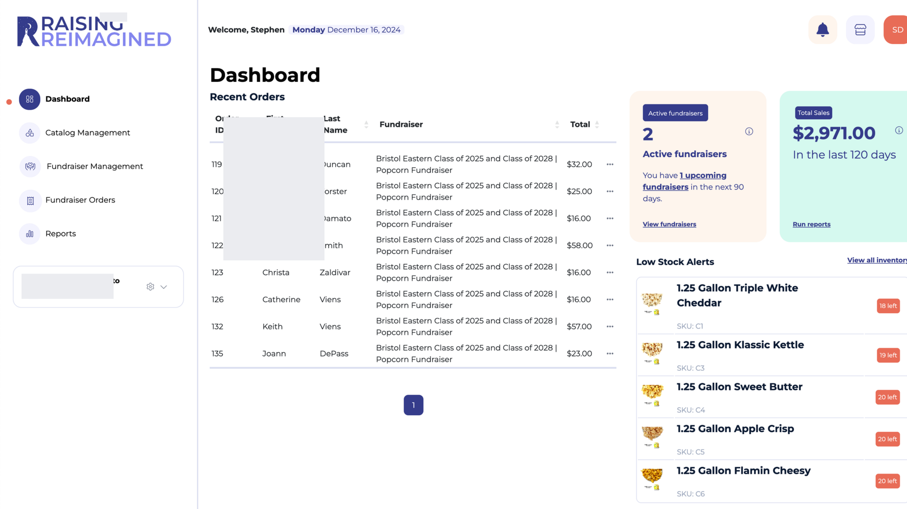

<strong>More screenshots</strong> — Login · Fundraiser Management · Catalog · Orders

 

  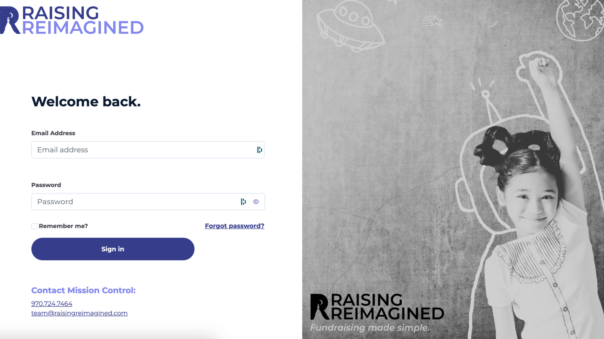

  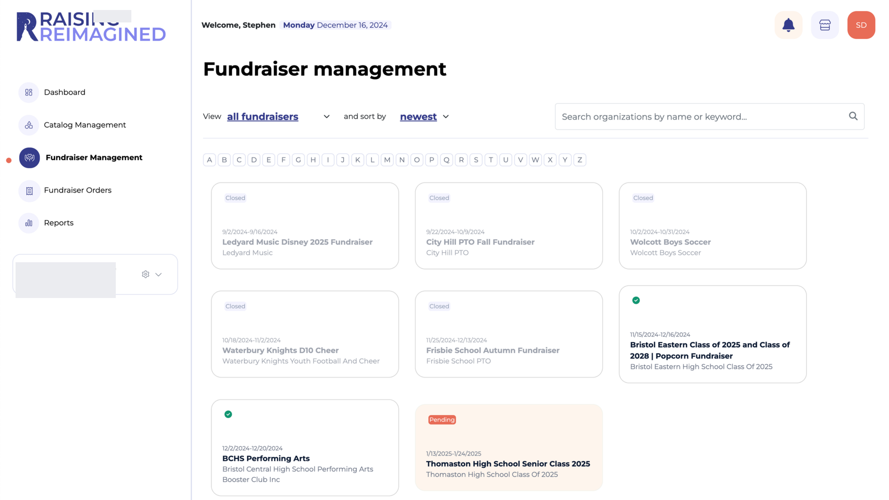

  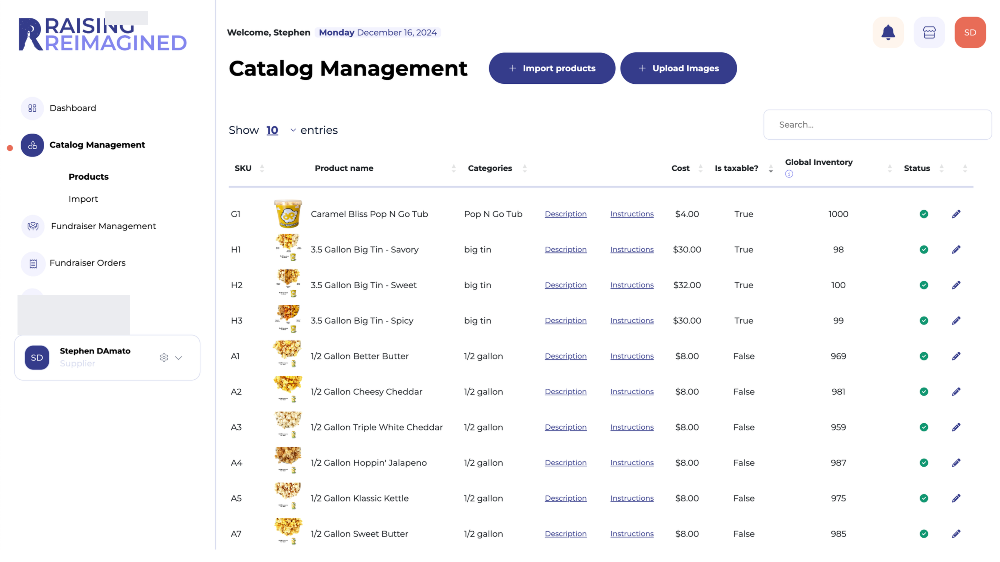

  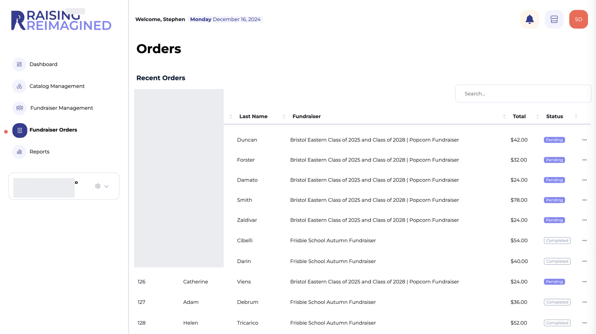

---

## Problem → Solution

Traditional school fundraising is broken. Organizations spend months coordinating paper catalogs, collecting cash, and managing logistics. Small local suppliers can't compete with big national catalogs. Families are stuck with overpriced products. And everyone loses a cut to middlemen.

**Raising Reimagined is a three-sided marketplace where organizations keep 100% of their fundraising profits.** That's the core differentiator — we don't take any of the organization's money.

| Side | What They Get |
|------|--------------|
| **Suppliers** (local businesses) | Online microsite, inventory management, access to school communities — the e-commerce tools they can't afford to build |
| **Organizations & Teams** | Create campaigns in minutes, no paper or cash, branded storefront with curated local products |
| **Supporters** (families) | Buy from trusted local suppliers, money goes directly to the organization |

  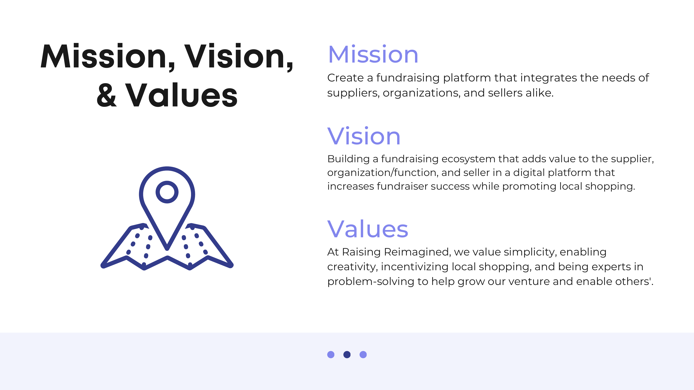

---

## How I Built It

**Phase 1 — MVP (Dec 2022 – Easter 2023):** Core marketplace, Stripe Connect payments, admin dashboard. Launched beta with initial school partners for Easter 2023 season.

**Phase 2.0 — Scale (2023 – 2024):** Multi-campaign support, seller dashboards, analytics, sweepstakes feature. Grew to ~5K users and 198 campaigns.

**Phase 3.0 — Full Rebuild (Current):** Total platform rebuild for next stage of growth.

Key product decisions:

- **User research drove architecture** — PTO leader surveys revealed the #1 pain was logistics (40 hrs/campaign), not product selection. Built around automation and self-service.
- **No-cost model shaped payments** — Stripe Connect handles money flows between all three sides without us taking from the fundraising pool.
- **Four user types, one platform** — Balanced suppliers (inventory tools), schools (simplicity), families (convenience), and admins (control) in every feature decision.
- **Phased validation** — Launched MVP for a single Easter season to validate with real campaigns before investing in Phase 2.

---

## Strategic Framework

  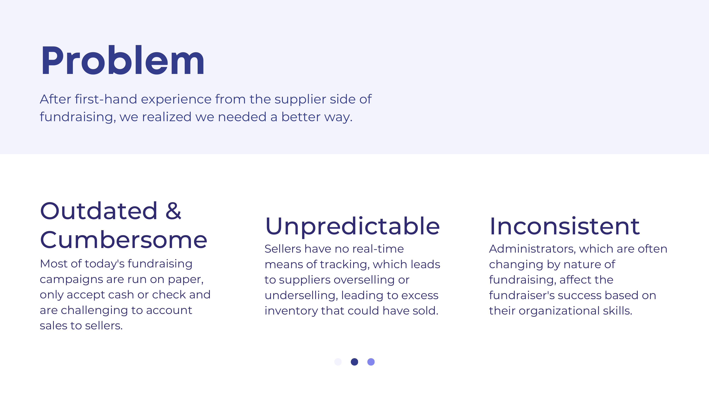

<strong>More frameworks</strong> — SWOT · Growth (AARRR) · Go-to-Market · Strategy Pyramid

 

  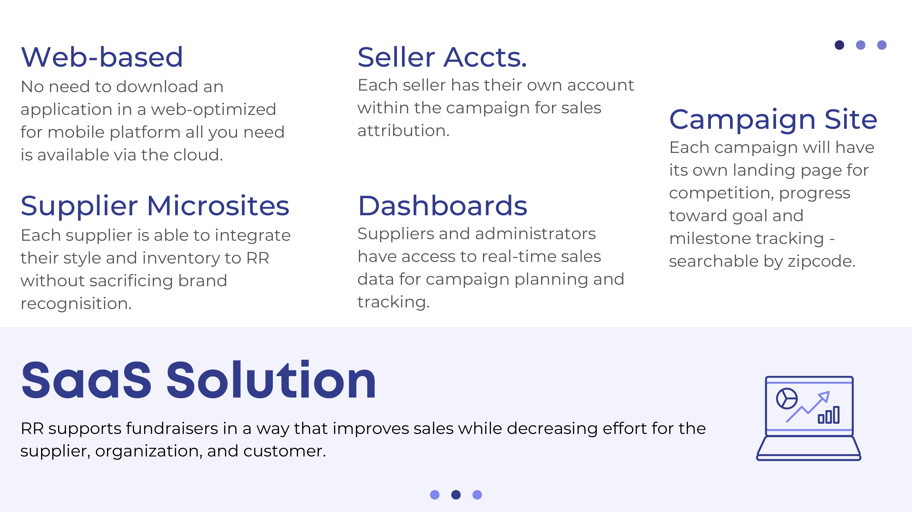

  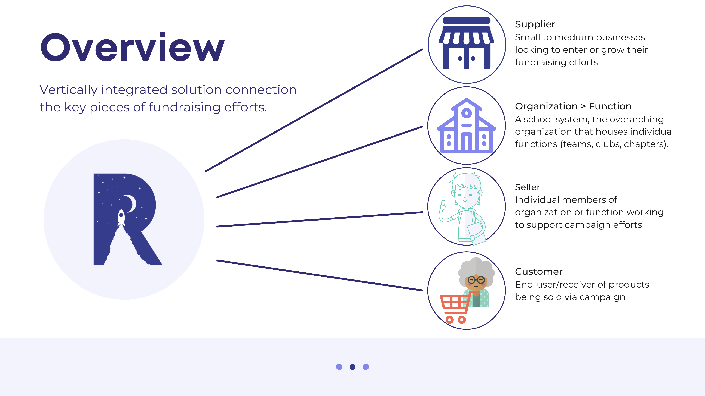

  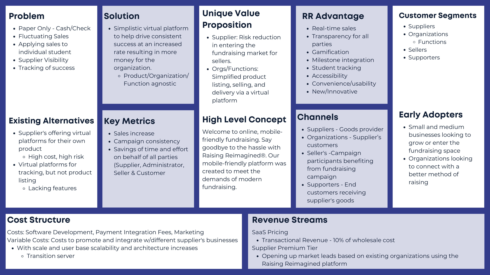

  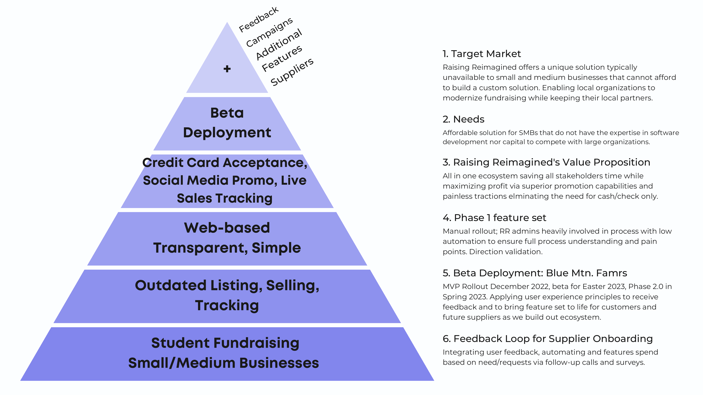

---

## Tech Stack

Web-based SaaS (mobile-optimized) · Stripe Connect for marketplace payments · Role-based access control (4 user types) · Supplier microsite framework · Real-time campaign analytics

---

*Built by [Paige Miller](https://github.com/paige-millz) — Co-Founder & CEO*
